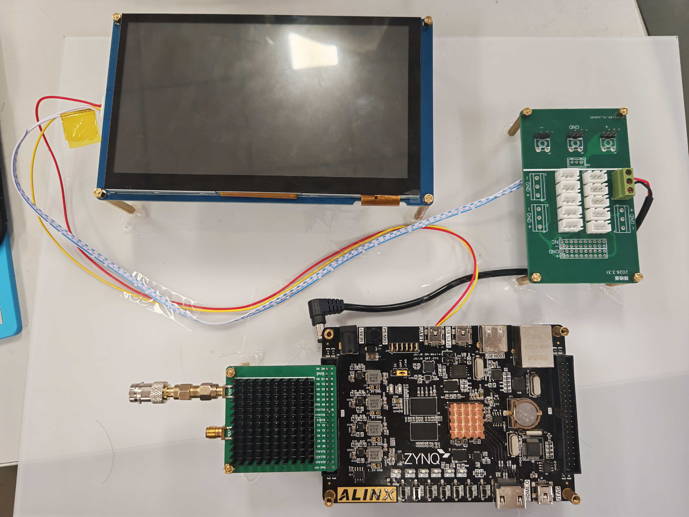
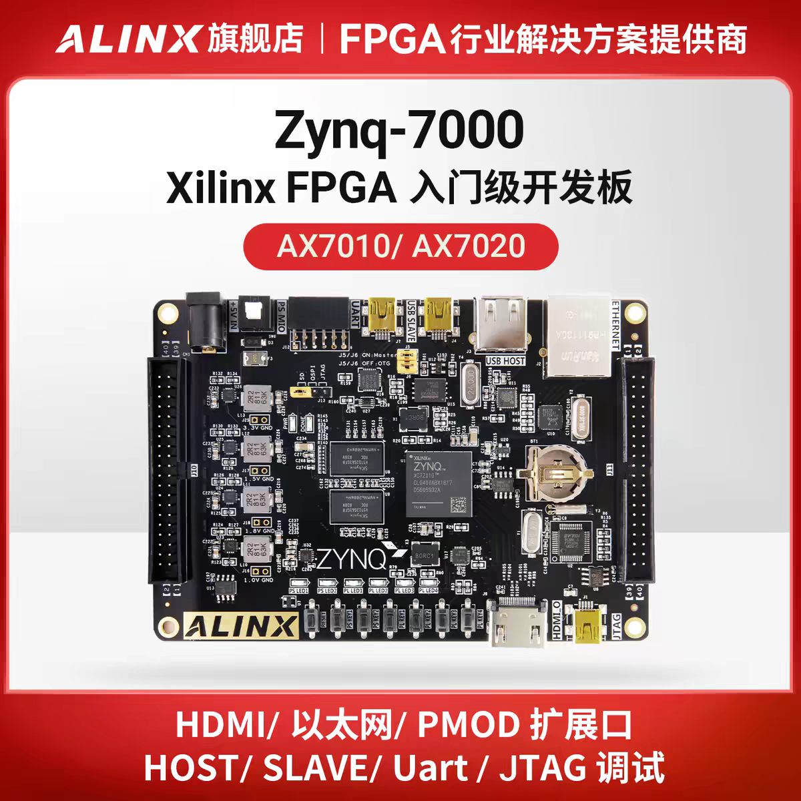
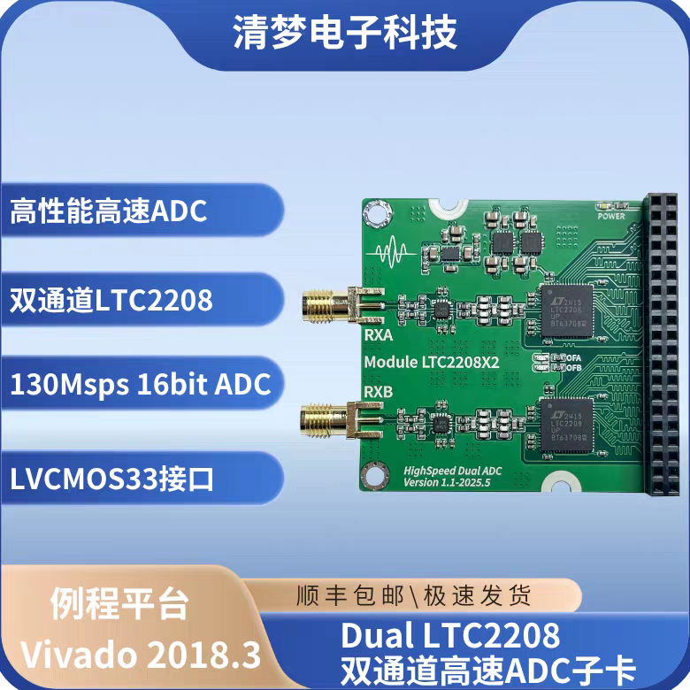
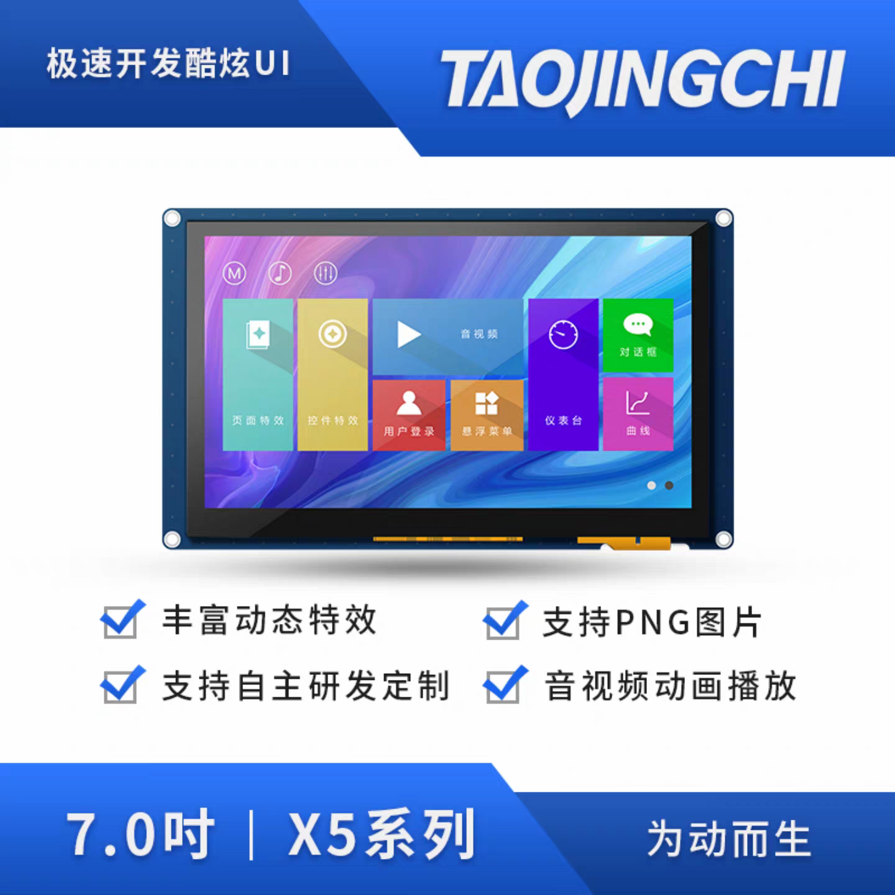

# 2026 NUEDC Problem G Reference Project

English | [中文](README.zh-CN.md)

## Periodic Signal Measurement and Analysis Device

A periodic-signal measurement and analysis project based on the **Black Gold AX7020 / Zynq-7020**, intended for studying, simulating, and extending Problem G of the 2026 National Undergraduate Electronic Design Contest.

The project contains a complete FPGA + ARM processing chain:

```text
LTC2208 ADC acquisition
    ↓
PL-side data reception and preprocessing
    ↓
FIR decimation filter → Blackman-Harris window → FFT spectrum analysis
    ↓
Zynq PS-side measurement algorithms
    ↓
Serial-display measurement output
```

The main measurements include periodic-signal frequency, peak-to-peak value, RMS value, spectrum, and harmonic-related information.

## 1. Hardware setup

- Black Gold AX7020 development board;
- LTC2208 high-speed ADC module;
- TJC8048X570_011C serial display;
- Signal source, cables, and power equipment.

### Overall connection



### Wiring

- **AX7020 to the TJC serial display**: the display connects to PS UART1. The project uses `MIO8` / `MIO9` by default, with `MIO8` as `TX` and `MIO9` as `RX`. Cross the serial lines—AX7020 `TX` to display `RX`, and AX7020 `RX` to display `TX`—and connect `GND`.
- **AX7020 to the LTC2208**: the current design uses LTC2208 **channel B**, connected through the AX7020 IO1 (J10) header. Channel-B data maps to `adc_b_data[15:0]`, and the sampling clock maps to `adc_b_clk`; channel A is not enabled. See [`rtl/ltc2208_ax7020_io1.xdc`](rtl/ltc2208_ax7020_io1.xdc) for the pin assignments.
- **Signal input**: connect the signal source to LTC2208 channel B, and power and ground the AX7020, LTC2208, and serial display according to their hardware requirements.

### Hardware references

#### Black Gold AX7020 / Zynq-7020 development board



[Taobao product link](https://c.tb.cn/h.87HmlmyfVovgydo?tk=yaU0TYGoELO)

#### LTC2208 high-speed ADC module



[Taobao product link](https://c.tb.cn/h.87HnJrG5rrqyx6M?tk=sqKfTYGpP6z)

#### TJC8048X570_011C serial display



[Taobao product link](https://c.tb.cn/h.8jgpUamCFA43wRa?tk=TJnbTYGqnWH)

See [`doc/AX7020开发板 IO引脚分配总表.md`](doc/AX7020开发板%20IO引脚分配总表.md) for board-level pin assignments.

## 2. Development environment

| Item | Configuration |
| --- | --- |
| Development board | Black Gold AX7020 |
| FPGA | `xc7z020clg400-2` |
| ADC | LTC2208 |
| Serial display | TJC8048X570_011C |
| Zynq-7020 development tools | Vivado 2022.2, Vitis 2022.2 |
| Serial-display host tool | USART HMI (TJC IDE) |
| Operating system | Windows + PowerShell |

Project configuration is centralized in [`config.tcl`](config.tcl). Directory boundaries and development rules are documented in [`AGENTS.md`](AGENTS.md).

## 3. Repository structure

```text
rtl/                   FPGA RTL, XDC, and DSP initialization data
vitis/src/             Zynq PS-side C sources
sim/                   Testbenches, C self-test entry point, and Python golden model
sim/host_include/      Host-side replacements for Xilinx headers
scripts/               Build, programming, cleanup, and debugging scripts
prj/                   Vivado Tcl project scripts and Block Design configuration
vitis/                 Vitis Tcl, boot configuration, and QSPI scripts
doc/                   Problem G PDF, AX7020 I/O notes, and hardware images
config.tcl             Central project configuration
AGENTS.md              Project development guide
2026_diansai.HMI       Serial-display project
```

The repository keeps source code, scripts, configuration, and study material. Vivado/Vitis workspaces and build artifacts are excluded.

## 4. Quick start

1. Install Vivado/Vitis 2022.2.
2. Prepare the AX7020, LTC2208, and TJC8048X570_011C serial display.
3. Download and install the [TJC USART HMI IDE](http://wiki.tjc1688.com/start/download_ide.html) to open and program `2026_diansai.HMI`.
4. Read [`doc/G题_周期信号测量分析装置.pdf`](doc/G题_周期信号测量分析装置.pdf) to understand the problem requirements.
5. Check the project settings in [`config.tcl`](config.tcl).
6. Run the commands required for the task.

### Vivado

```powershell
.\scripts\invoke-xilinx.cmd Vivado check
.\scripts\invoke-xilinx.cmd Vivado sim -TbTop tb_measurement_pl -SimTime 5ms
.\scripts\invoke-xilinx.cmd Vivado synth
.\scripts\invoke-xilinx.cmd Vivado build
.\scripts\invoke-xilinx.cmd Vivado all
```

### Vitis

```powershell
.\scripts\invoke-xilinx.cmd Vitis build
.\scripts\invoke-xilinx.cmd Vitis all
```

Common choices:

- RTL-only changes: run `Vivado synth`, or `Vivado build` when a bitstream is needed.
- Simulation-only changes: run `Vivado sim`.
- Block Design, IP, or PS configuration changes: run `Vivado all`.
- Existing Vitis software changes: run `Vitis build`.
- PS+PL hardware changes: run `Vivado all`, then `Vitis update` and `Vitis build`.

## 5. Simulation and algorithm study

The `sim/` directory contains:

- `tb_measurement_pl.sv`: testbench for the measurement processing chain;
- Additional testbenches for the ADC interface, filtering, and data saturation;
- `golden_model_test.py`: Python reference model for comparing filtering, windowing, FFT, and measurement algorithms;
- `measurement_c_selftest_runner.c`: host-side C self-test entry point.

Simulation must report `TEST_PASS`. A useful reading path is to begin with the testbenches and Python golden model, then continue with the RTL and Vitis algorithm sources.

## 6. Programming and debugging

```powershell
.\scripts\download-jtag.cmd
.\vitis\program-qspi.ps1 -PreflightOnly
.\scripts\capture-ila.cmd
.\scripts\clean-generated.cmd -DryRun
```

See [`AGENTS.md`](AGENTS.md) and the corresponding scripts for JTAG programming, QSPI, and ILA usage.

## 7. Recommended reading order

1. Read the Problem G PDF to understand the input signals, measurements, and task requirements.
2. Read `config.tcl` and `AGENTS.md` to understand the project entry points.
3. Run the testbenches and `golden_model_test.py` under `sim/`.
4. Read `rtl/` to understand acquisition, filtering, windowing, FFT, and the AXI-Stream data path.
5. Read `vitis/src/measurement_algorithm.c` to understand the PS-side measurement algorithms.
6. Read `vitis/src/hmi_protocol.c` to understand serial-display communication.
7. Connect the AX7020 and peripherals for board-level debugging.

## 8. References

- [`AGENTS.md`](AGENTS.md): project rules, build commands, and cleanup guidance;
- [`config.tcl`](config.tcl): central project configuration;
- [`doc/G题_周期信号测量分析装置.pdf`](doc/G题_周期信号测量分析装置.pdf): Problem G specification;
- [`doc/AX7020开发板 IO引脚分配总表.md`](doc/AX7020开发板%20IO引脚分配总表.md): AX7020 pin reference.